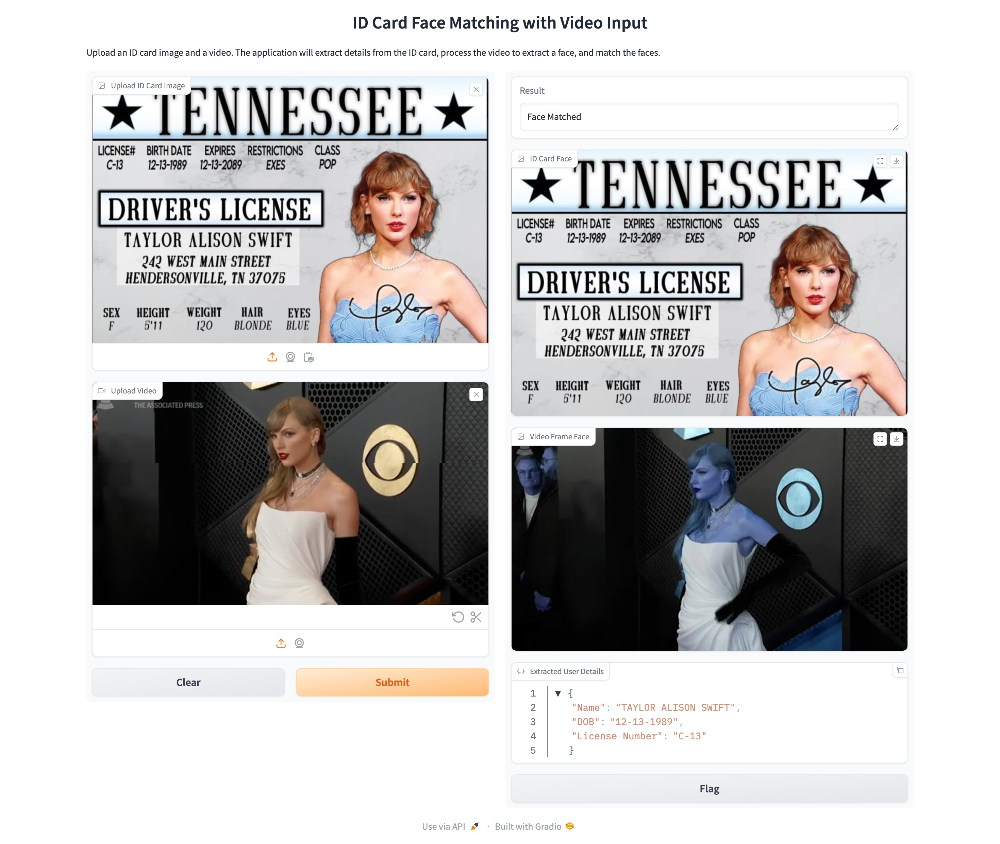

# ID Card Face Matching with Video Input




This project allows you to upload an ID card image and a video. The application extracts details from the ID card, processes the video to extract a face, and compares the two faces to determine if they match.

## Features
- Extracts text from an ID card image using Tesseract OCR.
- Extracts the face from the ID card image using `face_recognition`.
- Matches the face in the ID card with a face in the uploaded video.
- Displays the result, the faces from both the ID card and the video, and the extracted details from the ID card.

## Requirements

### Python Libraries:
- `gradio`: For building the user interface.
- `opencv-python`: For image and video processing.
- `face_recognition`: For face detection and recognition.
- `numpy`: For handling image arrays.
- `pytesseract`: For extracting text from images using Tesseract OCR.

To install these libraries, use the following command:

```bash
pip install gradio opencv-python face_recognition numpy pytesseract
```

### Install Tesseract OCR

**Tesseract** is an open-source OCR (Optical Character Recognition) engine used to extract text from images. To install Tesseract on your system, follow the instructions below:

#### For Windows:
1. Download the Tesseract installer from the official repository:
   - [Tesseract for Windows](https://github.com/tesseract-ocr/tesseract/wiki)
2. Run the installer and follow the installation prompts.
3. Add the Tesseract path to the system's `PATH` environment variable:
   - The default installation path is usually: `C:\Program Files\Tesseract-OCR	esseract.exe`
   - Add this path to your environment variables so `pytesseract` can access Tesseract.

#### For macOS:
1. Install Homebrew (if not already installed):
   ```bash
   /bin/bash -c "$(curl -fsSL https://raw.githubusercontent.com/Homebrew/install/HEAD/install.sh)"
   ```
2. Install Tesseract using Homebrew:
   ```bash
   brew install tesseract
   ```

#### For Linux (Ubuntu/Debian-based):
1. Install Tesseract using `apt`:
   ```bash
   sudo apt update
   sudo apt install tesseract-ocr
   ```

After installation, verify that Tesseract is installed correctly by running:

```bash
tesseract --version
```

### Environment Setup for Tesseract in Python

Once Tesseract is installed, make sure that Python can find it. You might need to specify the path to the Tesseract executable in your script:

```python
import pytesseract

# Set the path to the tesseract executable if it's not in your PATH
pytesseract.pytesseract.tesseract_cmd = r'C:\Program Files\Tesseract-OCR	esseract.exe'  # For Windows
# For macOS/Linux, this is typically not needed if Tesseract is in the system PATH
```

## How It Works

1. **Extract Text from ID Card Image**: 
   - The `extract_text_from_image()` function converts the image to grayscale and then uses Tesseract OCR to extract text.
   
2. **Parse ID Card Details**:
   - The `parse_id_card_details()` function parses the extracted text to retrieve important details like the **License Number**, **Date of Birth (DOB)**, and **Name**.
   
3. **Face Detection and Matching**:
   - The ID card face is detected using `face_recognition`, and a face encoding is generated.
   - A video is processed to extract the first frame with a detected face.
   - The faces from the ID card and the video are compared using the `compare_faces` function from `face_recognition`.

4. **Gradio Interface**:
   - The Gradio interface allows users to upload an ID card image and a video, view the matching results, and see the faces and extracted details.

## Usage

1. Run the Python script to launch the Gradio interface:

   ```bash
   python your_script_name.py
   ```

2. Open the Gradio app in your web browser, which will be automatically launched.
3. Upload the **ID Card Image** and **Video**.
4. The application will:
   - Extract details from the ID card.
   - Detect faces in both the ID card image and the video.
   - Compare the faces and show the result (whether the faces match).

## Example

Here’s how the process works:

- **Input**:
  - Upload an ID card image (containing text and a face).
  - Upload a video (containing a face).
  
- **Output**:
  - A text result indicating whether the faces match.
  - Display the detected faces from both the ID card and the video.
  - Show the extracted details (Name, DOB, License Number) from the ID card.

## Troubleshooting

- If you're facing issues with Tesseract not working, make sure that the Tesseract path is correctly set in your environment or Python script.
- If no faces are detected, ensure that the images or video are of good quality, with faces clearly visible.

## License

This project is licensed under the MIT License.
